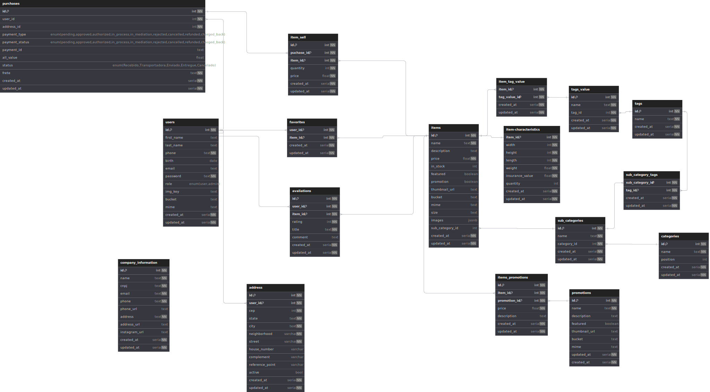

# 🚀 API REST e Pagína administrativa para e-commerce

Este repositório contém um projeto desenvolvido utilizando TypeScript, Sequelize, Express, PostgresSQL e AdminJs. A seguir, você encontrará um guia passo a passo interativo para abrir o projeto em seu ambiente local.

## Pré-requisitos

Antes de começar, verifique se você possui as seguintes ferramentas instaladas em sua máquina:

✅ Node
✅ Postgres

## Passo 1️⃣: Clonar o repositório

Comece clonando este repositório para sua máquina local. Para clonar o repositório, clique no botão "Clone" acima ou execute o seguinte comando no terminal:

```bash
git clone https://github.com/Ellucidator/project_sst_V.3.git
```

Isso criará uma cópia local do repositório em seu ambiente.

## Passo 2️⃣: Instalação das dependencias
Execute o seguinte comando no terminal, isso fara com que as dependencias sejam instaladas:

```bash
npm install
```

## Passo 3️⃣: Criar o DB

No postgres crie o usuario responsavel pelo DB e crie o db do projeto. 

## Passo 4️⃣: Criar as variaveis de ambiente

No diretório raiz do projeto crie o arquivo .env seguindo os exemplos do .env.example

## Passo 5️⃣: Subir o modelo para o db local
Execute o seguinte comando no terminal, isso fara com que as tabelas do DB sejam criadas:

```bash
npx sequelize db:migrate
```
Feito isto o seguinte modelo deverá ser construido na maquina:



## Passo 6️⃣: Rodar o projeto

```bash
npm run dev 
```
Feito isso a api devera rodar na sua maquina, o painel administrativo podera ser acessado a partir da sua porta local
ex: http://localhost:3000/admin

Obs. O DB tem o controle dividido em duas partes: 
    1º Chamadas do administrador controladas pelo admin JS
    2º Chamadas do cliente controladas diretamente na API estas disponiveis no modelo do Postman abaixo:


# Consideções Finais

Tratas-se do meu primeiro projeto pessoal e foi desenvolvido com o objetivo de estudo, durante o desenvolvimento 
pude testar diversas tecnologias, estudar documentações, entender o processo por trás do desenvolvimento e da tomada de decisões,
a importancia de um codigo limpo e bem construido e o maleficio a longo prazo de um codigo mal escrito (Será um dos princiáis pontos a melhorar),
pude entender que a programação não tratasse somente de código e todo planejamento do pré-pós é tambem necessario e de extrema importancia,
por fim fico feliz por subir meu primeiro projeto e por tudo que aprendi durante o desenvolvimento.
